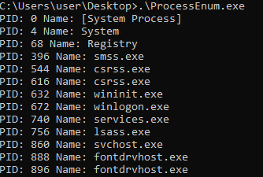

# Process Injection with C

## Description
ProcessEnum.c enumerates the processes in the system.

## API

APIs Used in ProcessEnum.c

CreateToolhelp32Snapshot
[text](https://learn.microsoft.com/ja-jp/windows/win32/api/tlhelp32/nf-tlhelp32-createtoolhelp32snapshot)

Process32First
[text](https://learn.microsoft.com/ja-jp/windows/win32/api/tlhelp32/nf-tlhelp32-process32first)

Process32Next
[text](https://learn.microsoft.com/ja-jp/windows/win32/api/tlhelp32/nf-tlhelp32-process32next)

## Sample Execution Results

